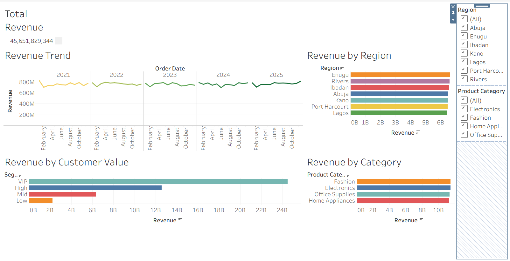

# 📊 Sales Performance Analysis (End-to-End Project)

## 📌 Project Overview
This project analyzes large-scale sales data to uncover key business insights across customer behavior, product performance, and regional trends.

The goal is to transform raw data into actionable insights that support strategic decision-making.

---

## 🎯 Business Problem
Businesses often struggle to understand:
- Which products drive the most revenue
- Which customers contribute the most value
- How performance varies across regions
- How revenue evolves over time

This project answers these questions using data.

---

## 🛠 Tools & Technologies
- Python (Pandas for data cleaning & transformation)
- SQL-style analysis (aggregation & segmentation)
- Tableau (data visualization & interactive dashboard)

---

## 🔄 Project Workflow

1. **Data Cleaning (Python)**
   - Handled missing values
   - Standardized column names
   - Converted date formats
   - Created new features (year, month, revenue)

2. **Data Analysis**
   - Revenue trends over time
   - Product category performance
   - Regional sales comparison
   - Customer value segmentation

3. **Visualization (Tableau)**
   - Built an interactive dashboard to present insights

---

## 📊 Key Insights

- 💰 Total Revenue: **₦45.6B+**
- 📈 Revenue shows consistent growth over time
- 🛍 Fashion & Electronics dominate sales
- 🌍 Regional performance varies significantly
- 👥 High-value (VIP) customers drive a large portion of revenue

---

## 📸 Dashboard Preview

---

## 💡 Business Impact

This analysis enables businesses to:
- Identify high-value customers and improve retention strategies
- Focus marketing efforts on top-performing regions
- Optimize product offerings based on revenue contribution
- Make data-driven decisions to increase profitability

---

## 📁 Dataset Note

Due to file size limitations, the full dataset is not included in this repository.

A sample dataset is provided for reference.

To recreate the analysis:
- Use the sample dataset
- Or generate a large dataset using the provided notebook
---

---

## 📌 Conclusion
This project demonstrates how raw data can be transformed into meaningful insights for business decision-making.

---

## 🚀 Next Steps
- Add machine learning for revenue prediction  
- Build a deployed dashboard  

---

## 👤Augustine Egwuatu
